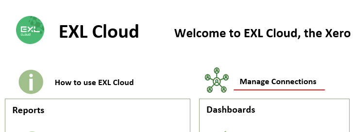
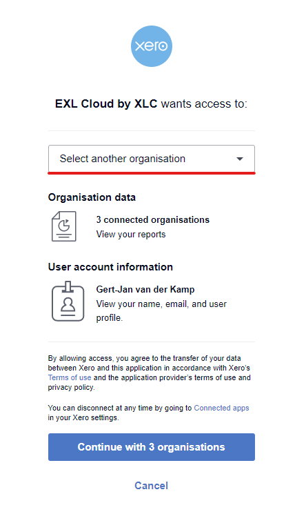

Before you can pull data from Xero organisations into Excel, you first have to tell Xero which organisations can be pulled. 

## Adding Connections

* Open ``Manage Connections.xlsm``
  

* Click ``Add`` to go through the Xero login process again to add a company. 

* After the password screen, you should see the  ``Select another organistation`` dropdown, select a company to add to EXL Cloud:

* Click ``Continue with X Organisations`` at the bottom.

The company you selected should now appear in the list of connected organisations. 

* Repeat this process until all organisations have been added. 

## Removing connections 

To Remove connections:

* Mark the organisarion you want to remove with an X
* Click ``Remove`` to remove the organisations from EXL Cloud

* The list of connections should now refresh without these organisations.