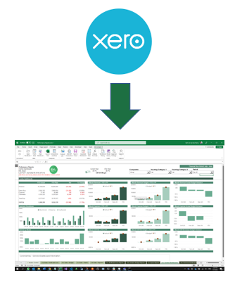
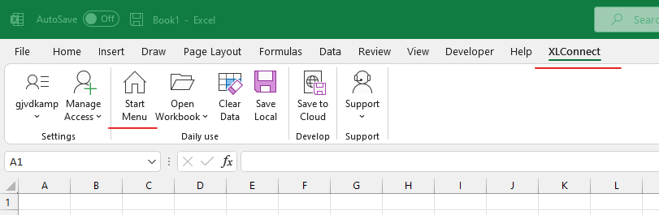
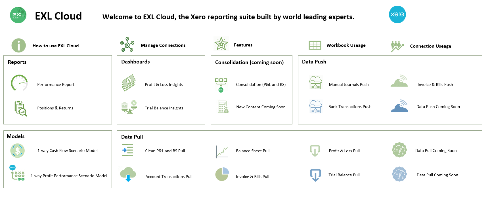
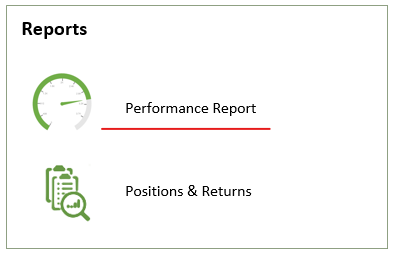
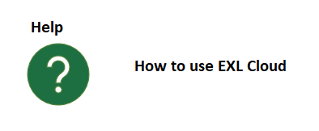
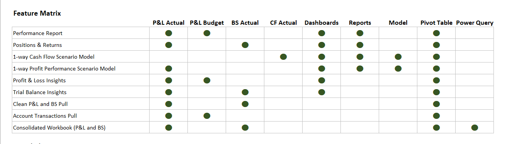

EXL Cloud is a partnership between XLConnect and world leading experts in Excel models and dashboards, to bring you prepackaged content connected to Xero out of the box. 

Built on XLConnect, the EXL Cloud workbooks behave like apps that pull in data from Xero. Because they're built in Excel you can easiliy understand how they work as the internals are open, and you can [edit and expand](exl-custom-content.md) them using your existing Excel knowledge. 

## Getting started 

If you signed up for [EXL Cloud](http://exlcloud.io) and have installed the add-in, you should see a ``Start Menu`` button on the ``XLConnect ribbon``. 

  

This will open up the ``Start Menu`` with links to the individual reports, organized into sections. 

  

* The icons open up reports. Let's start with Performance Report

  

* Hit the ``Demo`` button to pull in some demo data to quickly see it in action. 

This will quickly populate the report with sample data so you can see what it does. 

Next up, we want to populate the report using your own data, that is explained in section **[Using Workbooks](exl-using-workbooks.md)**.

## Quick help
* For help on using EXL CLoud, click the help icon bottom right. 

## Finding the right workbook

There are quite a few workbooks already and that number will increase over time. To help you find the right workbook for you please see the feature matrix. 

* Click on the Features icons on the top row

  

This will bring up the ``Feature Matrix`` that explains the datasources used by the report and what content it contains: 

  

