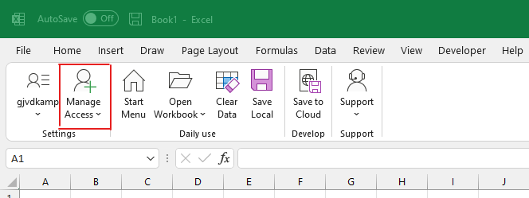
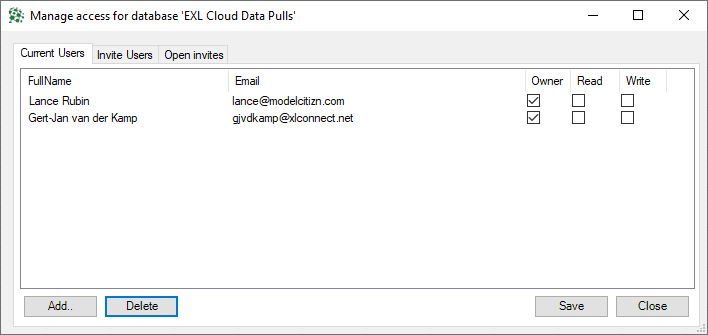
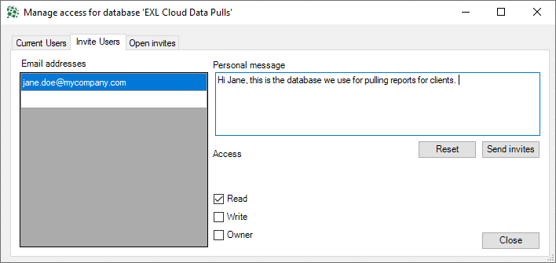
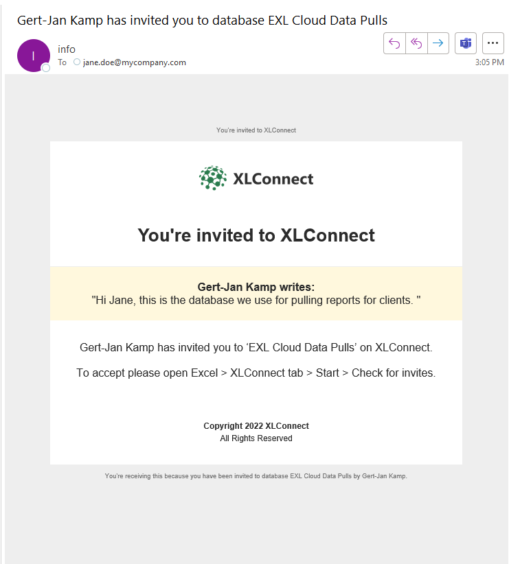
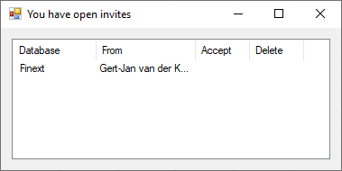

#Managing Users 

## Inviting New Users
To invite other users to your EXL Cloud subscription, use the ``Manage Access`` button on the taskbar.

  

This will bring up the ``Manage Access Dialog``:

  

Click ``Add`` to go to the next page. There do the following steps: 

1 Type the email addresses of the users you want to add on the left
2 Optional: Type a welcome message to the new suers in the ``Personal Message`` dialog
3 Optional: Set the access rights ``Read``, ``Write`` or ``Owner`` (see below for explanation)

Then hit ``Send Invites`` to send the invites. 

  

## Changing Access Rights

On the ``Manage Access Dialog``, you can add and remove access right by (un)selecting the tick boxes ``Read``, ``Write`` and ``Owner``. Then hit ``Save`` to write these changes to the server. 

> Make sure to always leave one Owner, else noone can edit the security anymore. If you accidentally locked yourslef out of your database please raise a ticket and we'll restore ownership to the user that originally took out the subscription.

## Removing Users

On the ``Manage Access Dialog``, select the users you want to remove access for, then click ``Delete`` to remove their access from the database. 

## What Access Rights Mean

### Subscription Database vs Content Database
When you sign up to a EXL CLoud subscription, you see two databases: 

* The ``Subscription Database`` that look like 'Your Company Name (Advanced)', if you are the owner of this database you can invite other users. You can also store edited workbooks into this folder. 
* The ``Content Database`` that is called 'EXL Cloud Advanced Content'. 

The content database is where all the Excel workbooks are that come with your subscription. These are develped by us, users only ever get read access to that. 

You control the access to your ``Subscription Database``, when you give people access to that, they can also read workbooks from the ``Content Database`` that comes with the subscription. The Access Level you set for your users only applies to the ``Subscription Database``. 

### Read
User can open workbooks and read data from the subscription database, but not write. 

### Write
User can save changes to the subscription database (usually this only makes sense if they have Read access else they can't see or open any workbooks).

User with Read access can edit the workbooks that come with the subscription and save them in the Content Database. This way the workbooks can be edited to better fit users requirement like logos, themes, charts, custom calculations etc and still pull data from cloud systems.

See [Creating Custom Content](exl-custom-content.md)

### Owner
User has both Read and Write, and can also configure access for other users.

## What Invited Users Will See
Invited users will receive an invitation email and a popup when they open Excel. 

### Invitation Email
Invited users will receive an email in their inbox that contains the welcome message you entered.

  

### Popup in Excel
When users have 
  