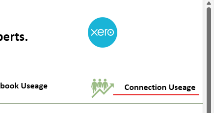

#Metered Billing

## Connected Organisations
To be able to pull data from Xero, you first have to tell Xero you will allow this. For that you have to add a Xero Organisation to your login during the login process: 

  

When you open the 'Select Another Organisation' dropdown, you can see which companies you have access to, but are not yet connected to EXL CLoud. Below that is the 'Already connected' list. That means you indicated to Xero that EXL Cloud can pull data. 

  

To add an organisation to EXL CLoud, select it from the top half of the dropdown then hit ``Continue with X organisations``. The login will continue and you'll return to Excel. To add more companies, go through the cycle again until you've connected them all. 

## Metered Billing

The monthly bill is driven by the total unique number of organisations that users have connected. This is to align with public accouting practices, so the value added is detemrined by the number of clients that EXL Cloud us used for.

After the first person has connected an organisation, it counts as 1 connection of the bill, no matter how matter other people also connect that organisation. Every connected organisation is counted only once. 

## Reporting the number of connections
You can monitor the connection usage for your team to prevent surpise bills, for that open the ``Connection Usage Report`` in the top right corner of the Start Menu. 
  

The monthly bill is determined by the ``Month Unique`` on the report, the unique number of organisations that was connected at any point during the month.

## Adding Connected Organisations
You can add organisations by hitting the ``Add`` button on any report. 

  

That will let you go through the Xero login process again to get the dropdown to connect organisations. 
When you do that, you add them to your personal 'key chain'. Every user can only do this for themselves, if another users need to pull data, they will also need to add it to their key chain themselves. 

## Removing Connected Organisations
To remove connections you don;t use anymore, use the ``Manage Connections`` button on the ``Start Menu``.

  

This will allow you to mark connected organisations with an 'x' then hit ``Delete`` to remove the connection. If the last person deletes an organisation, it will no longer count towards the bill starting next billing cycle. For this month it will still count as it was connected at some point. 