# The first 10 minutes

This chapter will guide you through the first 10 minutes of XLConnect, to quickly show you a few features. It assumes you have the add-in installed, if you haven't please see the [installation guide](/)

## Logging in

XLConnect integrates with Excel through an add-in, so start Excel to start the tutorial. 

* launch Excel from the start menu or any shortcut you may have. 

* If you see the Excel Start Screen below (because you haven't disabled it) press ``Blank workbook``

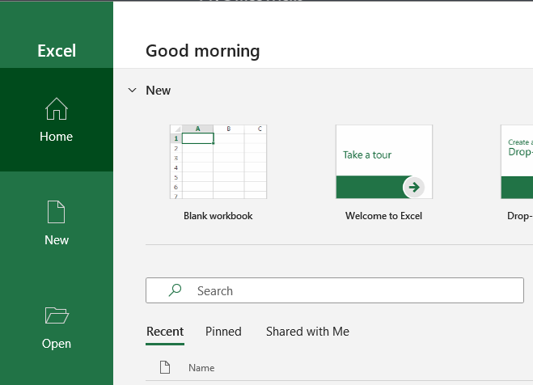

When you do this the first time after installing XLConnect you should notice 2 new things: 

* a taskpane on the lefthand side of the screen called ``Launch pad``
* a new menu ribbon at the top of the screen labeled ``XLConnect``

If you do not see the Launch Pad you can open it through the XLConnect ribbon with this button: 

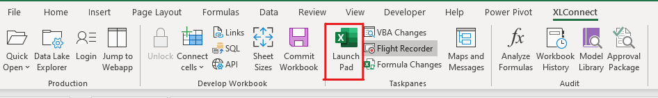

XLConnect connects to the cloud, to do that you must log in. To do that:

* click the button ``Log in`` in the middle of the ``Launch pad``. 

This will open a browser and go to the XLConnect login page. If you are logged in there already, it will take that identity and immediately return to Excel. Then you can continue with the next step. Else you will be greated by this login screen:

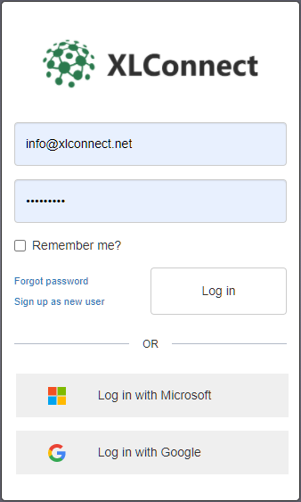

Login with the email adress and password that was in the invitation (please note that invitations to databases are tied to an email address). If you have a social provider (Micirosoft or Google) for that email address, you can use that to login without having to make a further account. 

**Note**: the login is done using your personal browser as a security best practice. If you use an identity provider like Microsoft or Google you can verify in the address bar that you are giving your credentials only to them. All they do is verify to us that you are indeed the owner of that email adress, this does not us give your password or access to any of your assets. 

After logging in the dialog will disappear and you will notice two new databases have appeared in the Launch Pad (note the tutorial database has been expanded in this example).

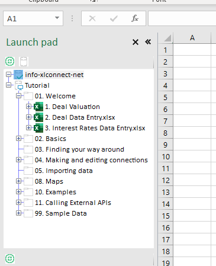

* One database resembles the email address you used to login, this is your personal database. Think of that as your 'My Documents' folder on the platform, only you can access this database and you have full control to store data and workbooks.
* A second database called ``Tutorial`` that contains samples used in this tutorial. You can only read from this database because it is shared among all users.

## Opening a workbook 

The first step in the tutorial is the Deal Valuation Model in the folder ``01 Welcome``. 

* Open the folder, and **doubleclick** the workbook ``1. Deal Valuation`` to open it. 

You screen should now look like this:
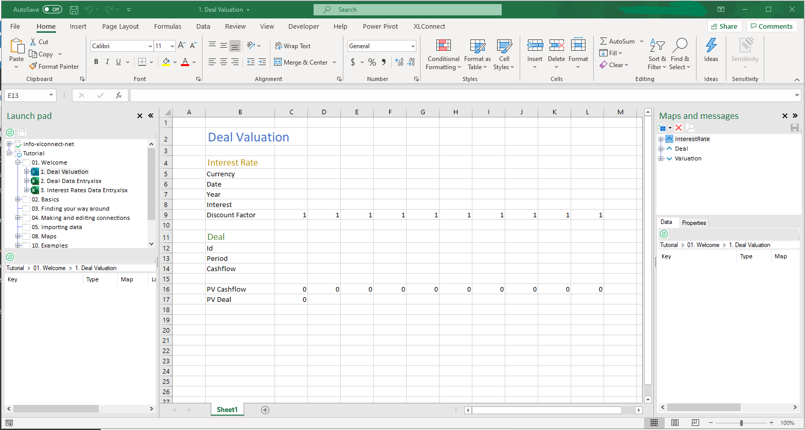

This is a simple workbook that computes the present value of a set of cashflows (called a deal). To do that it needs two inputs: 

* An Interest rate curve in range ``C8:L8``
* A series if casflows called a deal in range ``C14:L14``

It computes discount factors based on the selected interest rate curve in range ``C9:L9``  and computes the total present value of the cashflows (end therefore the deal) in cell ``C18``.

## Loading messages 

Normally to use this workbook you would copy in the data from some other location, then save the workbook to store the result. In XLConnect, we can load the data into the sheet with a single action. To load the interest rate in the workbook:

* click ``InterestRate`` in the Maps and Messages taskpane on the top right. Then two InterestRate messages should appear at the bottom of the taskpane. We will explain what this all is exactly later. 

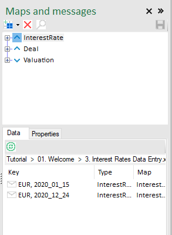

* **Doubleclick** the message ``EUR, 2020_01_15`` to load it into the workbook. If you have done so you should the data appear in the workbook. 

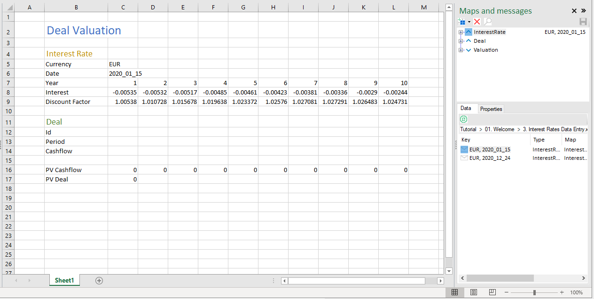

* Now select the select the ``Deal`` map in the top right pane, this should show you the available deals in the bottom right pane.

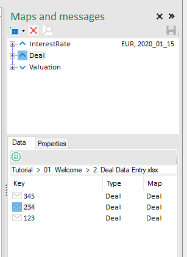

* Double click message ``234``  to load it into the workbook, that should now look something like this. 

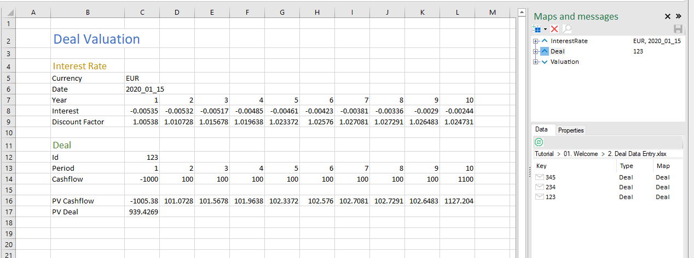

XLConnect has loaded the numbers of that deal into the workbook, and the Excel formulas compute the result in cell ``C17``. 

* Play around with loading different Interest Rates and Deals to see what the value is for different combinations. 

Swapping out different sets of numbers like this makes it easy to perform what-if analysis. 

## Viewing Messages

* As a final step, right-click any messages and select ``Show``.  

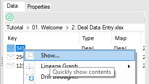

This will bring up the Message Viewer to display the details and contents of a message. 

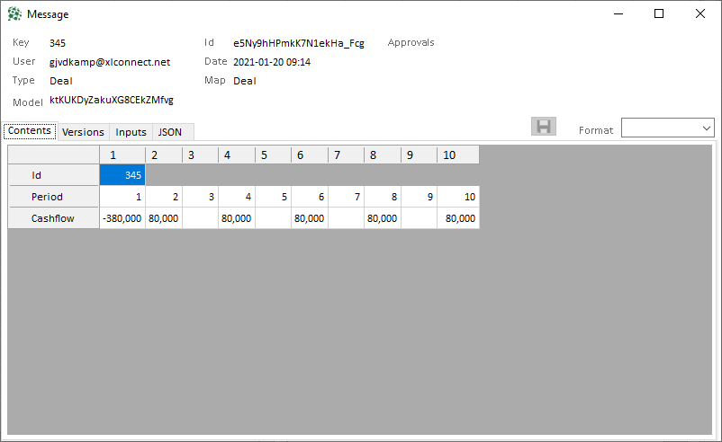

The Message Viewer will show the contents of any selected message to help figure out which one you want to load. Try to click other messages, then click the InterestRate map and select any of the messages in there to see their contents. 

* When you are done, close the MessageViewer. 

That's it for the first 10 minutes. You now know how to:

* login to XLConnect
* open a workbook 
* see the contents of messages
* load messages into a workbook to compute answers

In the next step we'll show how to save messages. See you there!