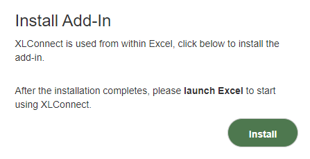
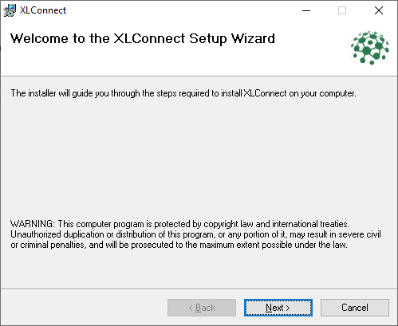
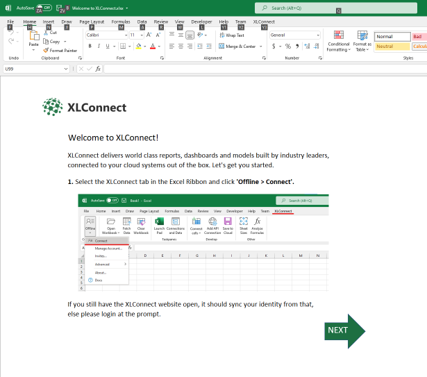
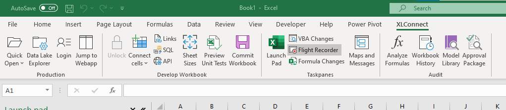
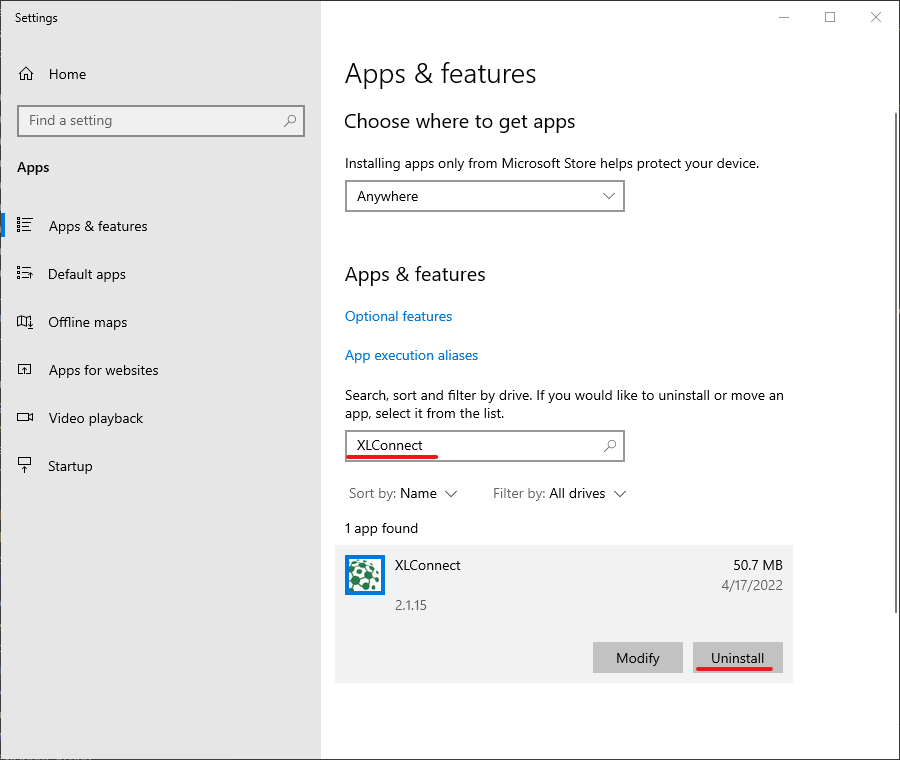

# Welcome to XLConnect

XLconnect is a platform where you use Excel to create data, perform calculations and build workflows in a truly agile way, by letting json data flow between Excel workbooks. 

## Installation

The Excel add-in can be installed from <a href='https://account.xlconnect.net' target='_blank'>your acount</a>, on the startpage there this section: 

  

> **Note**: XLConnect works only on Excel for Windows. To use it on a Mac, run the Windows version of Excel under Bootcamp or Parallels.

* Click on ``Install`` button to download the installer file ``XlConnect.Add-InSetup(x.x.x).msi``

* Double click  the file to begin the installation, this should bring up the following screen: 

      

* Hit ``Next`` until the installation finishes to install with default settings (usually recommended)

When the installation is finished it will launch Excel with this workbook: 

  

Follow the instructions in there to login and open your startpage. 

You're all set!

## Launching XLConnect

XLConnect integrates with Excel, **launch Excel** to start using it. There should be a new ribbon ``XLConnect``.

## Removing XLConnect

To remove XLConnect from your computer:

* go to the ``Add or remove programs`` settings page
* search for ``XLConnect``
* Press ``Uninstall`` to remove XLConnect from your computer.

  