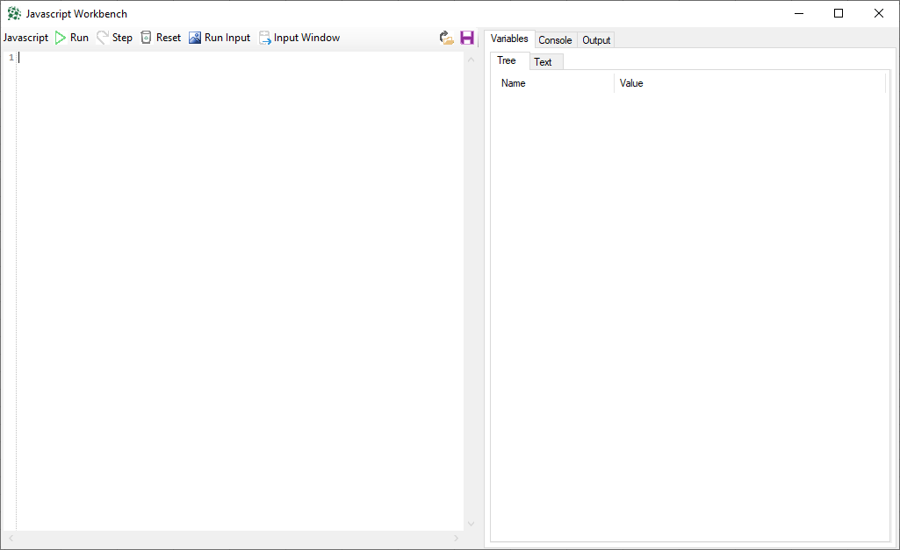

# Working with data off the web through javascript

## What is javascript 
Javascript was originally design to work in web browsers. To help web developers, the language was created to be every simple and effective. 
A particularly fast javascript was developed by Google for their Chrome browser: Google V8. The current version of V* is 9.7 which means it's pretty well rounded by now. 
That is the version of javascript that is used XLConnect. 

## Javascript Workbench
  

To use Javascript within Excel, you need to open the Javascript Workbench to edit and execute javascript code. It can be opened in two ways: 

* From the XLConnect ribbbon: Other > Javascript Workbench. This allows you to type and execute random code 
* From and ApiConnection: Right click the Api > Properties > Javascript. This code is part of the Api and will be executed when you call the api

## Some simple javascript 
```
myArr = []
for(i=1;i<10;i++){
	myArr.push(i)
}
myArr
```

This returns: 
```
[1, 2, 3, 4, 5, 6, 7, 8, 9]
```
To try for yourself, open up the Javascript Workbench, paste the code in the left window and press F5.

## JSON data 
JSON stands for JavaScript Object Notation, which basically does what it says on the tin: it lets you write down data in javascript. Here's an example: 

```
person1 = {
    id : 123, 
    firstName : "John",
    lastName : "Doe"
}
```
To try for yourself, open up the Javascript Workbench, paste this snippet in the left window and press F5.

The great thing about JSON is that it *is* javascript. There's no seperate language for code and data, it is all the same language which working with JSON data in javascript very elegant and effortless. 

### Data Types
JSON has 7 data types: 

* string :`` "Hello"``
* number : ``123.4``
* boolean: ``true``
* null : ``null``
* object : ``{ a : 100, b : "John" }``
* Array : ``[1, 2, 3, 4]``


### Objects

### Arrays

## The xlc type
getting to data is done with the ``xlc`` class, this is static type that is always available that can be used to read and write data off the web, or write it. 

### GET
``xlc.get(string uri, object headers = null, string auth = null)``

### PUT
``xlc.put(string uri, string content, object headers = null, string auth = null)``

### POST
``xlc.post(string uri, string content, object headers = null, string auth = null)``

### DELETE
``xlc.delete(string uri, object headers = null, string auth = null)``


## Grabbing JSON from the Datalake


## Storing JSON in the Datalake 

## 