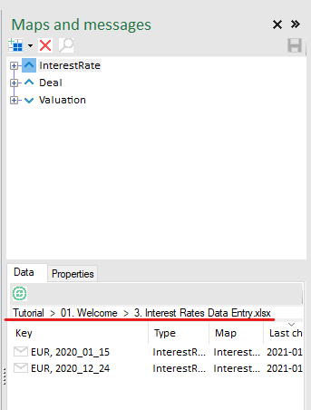
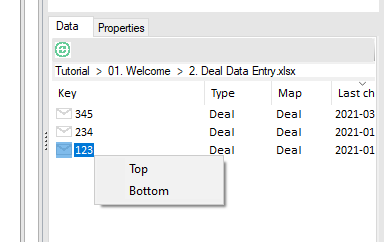
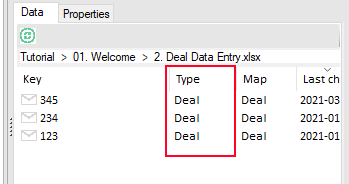
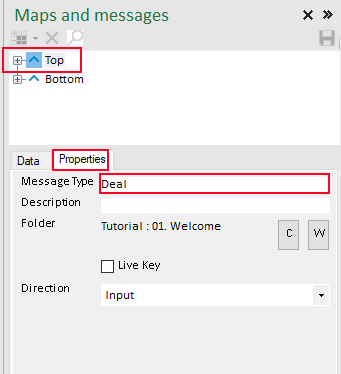

# Loading Messages

## From default location 

Maps usually have default locations set up where they look for messages. When you select a map (single click with the left mousebutton), that location is selected and the bottom panes of the Launch Pad on the left and the Maps & Messages pane on the right will show the contents of that location. 

The selected location is also shown in the address bar above the messages and the folder explorer. 

* Open workbook ``Tutorial  >  01. Welcome  >  1. Deal Valuation``
* Select the ``InterestRate`` map 

Notice that the Message Panes show this location: 
``Tutorial  >  01. Welcome  >  3. Interest Rates Data Entry.xlsx``

Secondly, that workbook is also selected in the Folder Explorer (it is light grey as that control is not active)

This tells us that the InterestRate messages (probably) came from the ``3. Interest Rates Data Entry.xlsx``. 

* Double click any of the messages to load them into the right map. 

This is how you select messages from the default location, select a map, then double click the message in the bottom pane. 

## From alternate location

Most of the time, maps will point to the right default location, in some cases you may want to load a message from somehwere else. This is also possible by using the folder explorer. 

* Open workbook ``Tutorial  >  01. Welcome  >  1. Deal Valuation``
* Select folder ``Tutorial  >  01. Welcome  >  Older Deals`` in the Lauch Pad
* Double click message ``a11`` to load a message from an alternate location 

When you select a map, it will automatically select the default location for that map, but you can find messages in an alernate location by navigating to it with the Folder Explorer. 

## Multiple maps of the same type 

One requirement that always pops up is the ability to compare two things, for instance two deals.

* Open workbook ``Tutorial  >  01. Welcome  >  4. Deal Compare``
* Double-click message ``123``, you should now see a popup appear that lets you select Top or Bottom. Select ``Top``.

* Double-click message ``234`` and put that into ``Bottom``  

The sheet now compares the two Deals and displays them and the difference between them in a chart. 

To explain how this works, we first need to introduce the concept of a Message Type. If you look at a Messages pane you can see the second column is Type, the type of the messages in this sheet is 'Deal'. 

Maps also have a Type: 

* Click map 'Top' 
* Select the Properties tab on the Messages pane

* Select Map Bottom to see it also has type 'Deal'

The way this works that if you double-click a message, it will look at the maps to see how many have the same type as the message: 

* 0: No map with this type yet, it brings up the Import Messagetype dialog to let you create a map for this message type. 
* 1: There's one map with the type of the message you're trying to load, it will load it into that map. 
* Mutiple: It wil bring up the maps that have the same type, then you can select in which map you want to put this message. 

