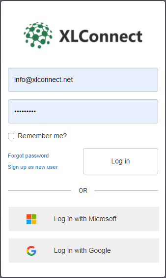

# Logging in 
 
## Web Client login

Click <a href='https://xlconnect-webapp.azurewebsites.net/' target=_blank>here</a> to open the webclient, if you are not logged in you will see this login dialog: 

**Note** If you received an invite, it will be tied to that email address. Use that address to login and be able to accept the invite, or ask the sender to invite you with another email address. 

There are two ways to log in: 

* Use either of the Identity providers Microsoft or Google if you have one for the acount you want to login with. 

**Security Note** 
>It is very important to safeguard your Microsoft or Google idenities. That is why we use your personal browser to let you log in. That way you can assert you are seeing the correct address and the lock symbol, to indicate the connection is secure before entering your credentials (if asked, often it is a click through process because you are already logged in): 

>

>

>Logging in through these providers serves as a sort of 'valet key' where Microsoft or Google verify to us that you are indeed the owner of that email address. It does not give access to any of your assets on the cloud. 

>For us these are the preferred methods for users to log in as they are secure and we will not have any sensitive information about you except your public email address. We take every known measure to secure account information, yet always the best way to keep a secret is to not know it. 

>And always, if you're not sure, ask IT. 

* Login using an XLConnect account. 

If you don't have a Microsoft or Google account with that email address or prefer to have an account on the XLConnect platform, you can enter the username and password. 

## Web Client log out 

* To log out, use the dropdown menu in the top right corner of the web-app and select log out:

## Web Client switch account 

Most people will use XLConnect with their work email address, but if you need to switch identities: 

* Log out as described above
* Log in with the new identity

## Excel Add-In Login

To log in on the Excel Add-In, press the Login buton on the Excel ribbon. 

* Click the button ``Log in`` in the middle of the ``Launch pad``. 

Or: 

* Click the Login Button on the XLConnect Ribbon menu 

Usually, the screen will flash and Excel will be logged in. That is because XLConnect uses the account of the web client to log in. If you are logged into the web client, the Excel Add-In will use that same account. 

## Excel Add-In logout 

Because the Excel Ad-In uses the login of the Web Client, logging out is a five step process, as we first need to log out on the web client, then sync that with the Add-In:

* Use the 'Jump to Web App' button to go to the Web App: 

* Log out there:

* Press the Log In button on Excel Ribbon:

* Just close your browser as we don't want to log in
* Click ``Cancel`` on the Login form: 

## Excel Add-In switch accounts

Switching accounts on the Excel Add-In also requires the web client to switch identities, then sync the Add-In: 

* Use the 'Jump to Web App' button to go to the Web App: 

* Log out there:

* Login Again with the required account: 

* Hit ``Login`` on the Excel ribbon to syncronise the Add-In with the Web Client: 

That should return you to Excel with the selected account. 