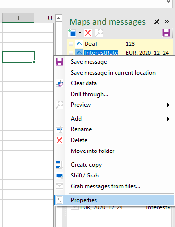
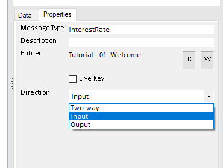

# Maps

Every map has several properties that can be set on the properties pane.

## MessageType

Every message has a type to indicate what sort of message this is.

When nothing is configured, the message type will be the name of the map, but this can be overridden by entering a value for message type.

IT is good practice to stick to a naming convention starting with the department or topic, this way naming conflicts can be avoided. (Sales.Order, Sales.Customer, Pricing.Order, Pricing.Customer etc.)

Dots are allowed in type name to create these values.

## Location

Every map, when selected, will navigate to a location where messages are either read from or written to. When nothing is configured, this will be the workbook itself (the messages appear to be &#39;in&#39; the workbook). On the workbook level, it can also be configured to popint to a folder. This can be convenient when exchanging messages between models and departments etc. Finally, every map can override this again to point to a particular location. This allows fine grained control over where messages appear and go.

When a message is imported from a particular location (folder or workbookheader), the imported map will be set to that location, so every time the user wants to select another message into that map, it opens the folder where that type of message is stored.

To set the location for either a map or workbook, select either a map or deselect (click on the backgrouwn) to select the workbook, then open the properties pane. This shows the location property.

Now use the folder tree on the left hand side no navigate to a particular folder, then hit &#39;C&#39; (for current) to select that folder. Select another map and go back to verify the correct folder is displayed.

## Live keys

Live keys can be active for a map, this means that when the keys for that map change (either through manual input or because another message was loaded that wrote to a key cell) it will try to load the message with that key.

This is handy for user interface work, where the user can select another period or country and the data load automatically, or to load particular reference data. Say a message is loaded that contains a date, then another map can lookup the interest rate curve for that date automatically.

### Simple live keys

When maps are marked as live keys, they will react to changes in them by loading that key.

### Interlocked Live keys

One map can write to the keys fields of another map, causing that map to load the message indicated by that key. Having one map write to the key fields of a live map his is called interlocked live leys.

When the master message is loaded, it will trigger the loading of specific (reference) data that is appropriate to compute a result for this message.

This can be used to mimic the behavior of foreign keys in databases. A field in the master map &#39;points&#39; to a key of another rmessage, when the master message is loaded, the related message is loaded too.

And example would a loan calculator where a date is entered. When that date is changed, this will trigger the loading of a particular interest curve.

This approach can be layered, where one message triggers the loading of other messages, which again trigger the loading of other messages, etc.

## Map direction

Maps can have a direction, to limit which way data can flow. This helps guide data in a certain direction and prevents accidental overwriting of data. 

* Select the map you want to edit and right-click > Properties 

This will select the properties tab in the bottom pane, where the Direction Property can be chnaged: 

* Input: data only goes from the datalake into the sheet 
* Output: data can only be saved to the datalake from this sheet 
* Two-way: Data can go both ways. 