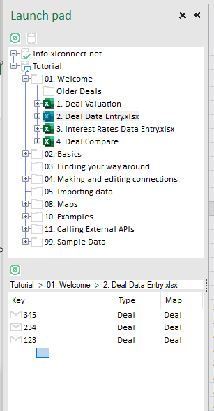
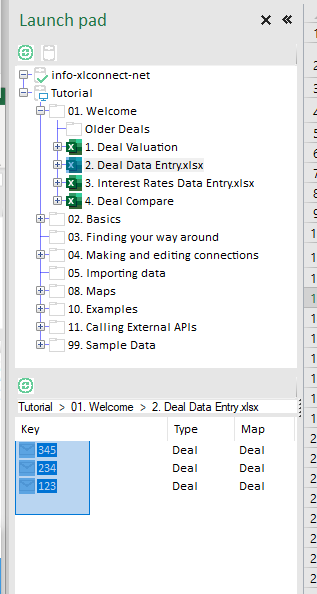
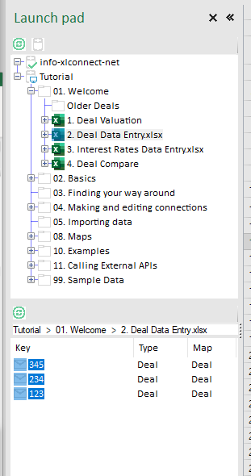
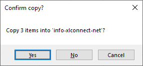
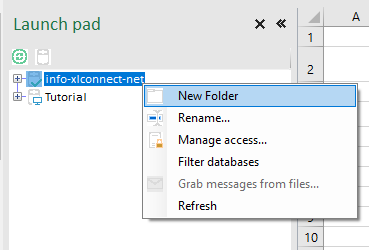
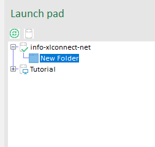
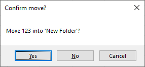

## Across databases

Moving items is as easy as drag & drop, if you have permission. Because you don;t have permission to move anything wihtin the Tutorials database, we will start by moving things across databases. 

* Select the workbook ``Tutorial  >  01. Welcome  >  2. Deal Data Entry.xlsx`` (you don't have to open it, ust selecting it will display the messages in that location)
* Drag a rectangle across the three messages there to select all three 
    * start to the right and below the last message 
    * hold down the left mouse button and drag the blue rectangle to select all three messages
    * release the left mouse button, the messages stay selected

* hold down the left mouse button on any of the selected messages, and drag them towards you personal database (info@xlconnect in this case, yours will have your email address). The target location will light up purple and the mouse cursor indicates 'drop' (mouse not shown in the screenshots)
* release the left mouse button to drop them, you should get this question: 

* Click ``yes`` to copy the messages to your personal folder. 

## Within a database

* Create a new folder in your personal database, optionally give it another name than default and hit Enter:

* Select the top folder again 
* Drag message ``123`` to ``New Folder`` 
* Say yes when you see this dialog: 

