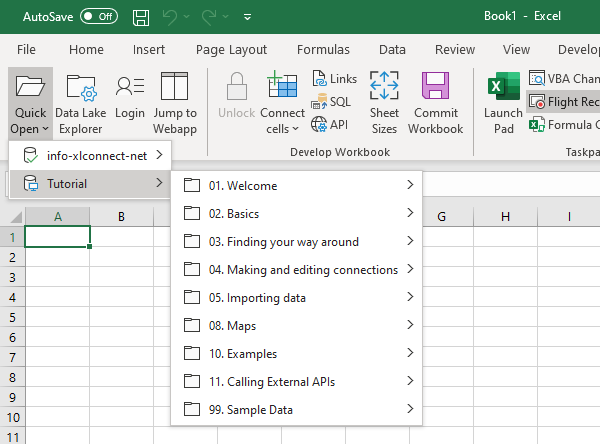
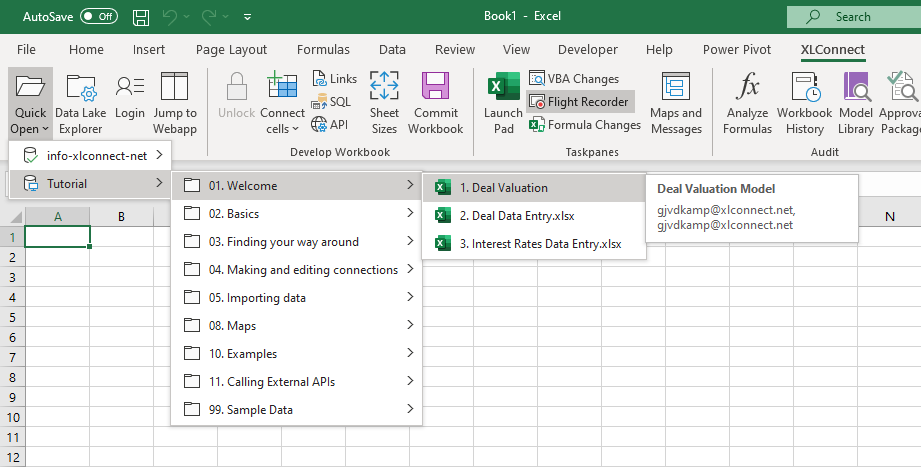
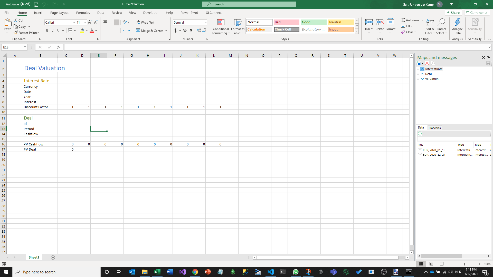

# Opening Workbooks 

This short chapter will show you how to open Workbooks from the Model Library. There are two ways to do that, from the Quick Open menu and from the Launch Pad. 

## Quick Open 

The Quick Open option is used to find a workbook to work on in the Model Library. 

* Select the XLConnect ribbon at the top of the screen in Excel and click on the left-most button labelled ``Quick Open``. 

This will drop down a menu with the databases you have access to: 

By hovering over a database, it will show it's contents. 

* Hover over the ``Tutorial`` database, then go to ``01 Introduction`` and hover over  ``1. Deal Valuation``.

This will display a tooltip with some useful information about the Workbook like the user who last edited it and the description. When workbooks get useful names and descriptions that can really help users find the right workbook for what they want to do. 

* Now click on ``1. Deal Valuation`` to open it. 

Your screen should now look like this: 

That's it, this is how you can open a workbook from the Quick Open menu. 

## Launch Pad 

The Quick Open menu described above is for light users of XLConnect that have the Launch Pad hidden. Heavier users of XLConect typically will have the Launch Pad open to quickly find required items. 

* Use the shortcut ``CTRL + SHIFT + E`` to show or hide the launchpad. Alternatively you can use the ``Launch Pad`` button on the ribbon (in the Taskpanes section)
* Open Databases and Folders to find the required workbook 
* Use the arrow keys to navigate through the tree 
    * Use ``Right`` to open a folder 
    * Use ``Left`` to go up a level or close a folder 
    * Use the ``Spacebar`` or ``Enter`` to open a workbook 

