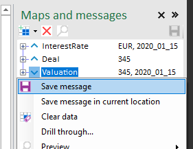
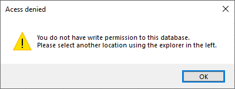
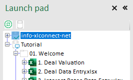
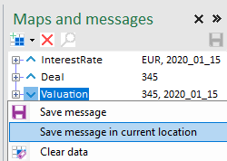

# Saving Messages 

In the previous tutorial we loaded messages into a workbook to compute results. In this episode we will show how to save these result into a message again. 

* Open workbook ``1. Deal Valuation``
* load an interest rate curve and deal into the workbook like you did in the previous tutorial (if you kept the workbook open from last tutorial you're already done)

Now we have a valuation that we want to save. 

* right click the 'Valuation' map and select ``Save Message``

You should get an 'Access Denied' message because the default location for this map is in the Tutorials database where you don't have write persmission.

* Now, in the top left pane (the Folder Explorer) select your personal database (the one that shows your email address)

* Then right-click the Valuation map again (top right corner), and select 'Save message in current location'. Make sure you only right-click, when you left click the location will be set to the value set in the map. 

You should now see a new message appear in the message panes (bottom panes left and right). 

* Right-click it then select ``Show..`` to verify that the numbers in the message are identical to the ones in the workbook. Congratulations, you just saved your first message with XLConnect! 

The difference between the two is:

* ``Save message`` saves messages in the location configured in the map.
* ``Save Message in current location`` saves the message in the location selected in the Folder Explorer. 

Most of the time it makes sense to save the output of a Map in the same location. This way the message will appear when a user working in a next workbook selects an input map. Most often data (messages) will flow through several workbooks to create the final result Map Locations help make that an intuitive process. But if there is a reason to save a message outside of that default flow that is also possible. 

