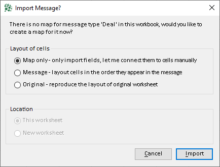
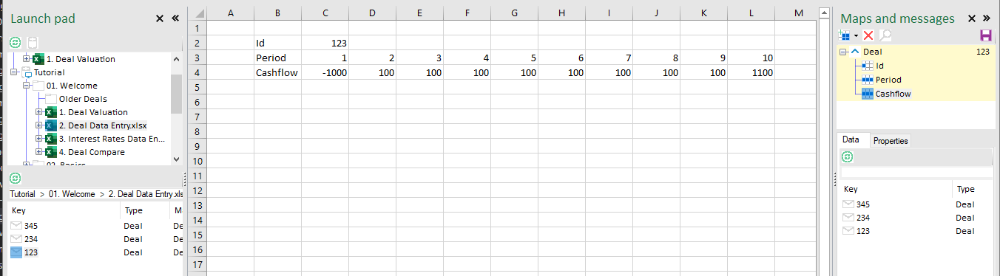
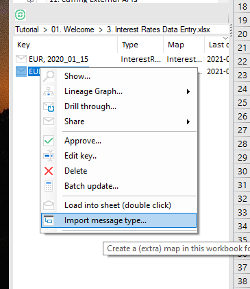

As a first excercise in developing workbooks, we will reproduce some of the workbooks from tha last chapter, starting with the deal valuation. 

## Importing Message Types

We will start by using exsisting data in the Data Lake and connecting to it by importing the type as a map. 

* Open a new blank workbook and open the Launch Pad 
    * if you cannot see the Launch Pad press CTRL + SHIFT + E to open it. 

* Navigate to ``Tutorial  >  01. Welcome  >  2. Deal Data Entry.xlsx`` 
* Double-click message ``123`` to bring up the Import Message Dialog

Now there are three didderent ways you can import a Message Type:

* ``Map Only`` will only create a map for this type, any connections to cells need to be created manually. 
* ``Message`` will create a map and create connections in the workbook in the order the data is layed out in the message. 
* ``Original`` will open the orignal workbook to map cells as they are in there.

### Map Only 

* Leave the setting to ``Map Only`` and click ``Import``. 

You will now see the Maps & Messages pane appear with a new map ``Deal``.

The orange back color means the properties are not connected. 

* Drag the connections onto workbook cells: 
    * ``Id`` to cell ``B3``
    * ``Period`` to cell ``C3``
    * ``Cashflow`` to cell ``D3``

**tip** 
> If you want to connect an array as a **column** hold down the ``CTRL`` key. This only works for arrays, single properties and 2D ranges are not affected. 

> If you want to insert a value between two other cells and create space for it, hold down the ``SHIFT`` key 

> If you want to insert an array as a column, hold down ``CTRL + SHIFT`` 

Your workbook should now look like this: 

* Double-click message ``234`` to see the numbers change to verify the corect cells are connected. 

This is how you can create connections as 'Map Only' by dragging individual properties to their intended location. This gives complete control over how connections are created and is useful when only a few properties of the message are going to be used. 

* Keep the workbook open for the next step 

### Message Layout 

Message Layout will automatically loop over the properties in the message and create connections for them. This is useful when you want to import every property in a message. 

* Navigate to ``Tutorial  >  01. Welcome  >  3. Interest Rates Data Entry.xlsx``
* Double-click ``EUR, 2020_12_24`` to bring up the Import MessageType dialog 
* Select ``Message`` and click ``Import`` 

Your workbook should now look like this: 

The new import is done straight against the left margin and the data above, let's create some space: 

* Select range ``A5:K8`` and move it one cell down and to the right (select the cells and then drag them there)

* Double-click other deals to verify the data is still put in the correct cells. 

That's how you can import Message formats automatically. This especially saves time when messages contain a lot of fields. You connect all the cells in one go and then drag them to their final location. 

### Original Layout 

The third way to import a message is to put all the cells in the same location as they were in the original sheet. 

**Note**: To be able to do this you need to have read access to the workbook that produced the message 

* Create a new empty Workbook (with CTRL + N)
* Navigate to ``Tutorial  >  01. Welcome  >  2. Deal Data Entry.xlsx`` (only navigate to it by selecting it, do not open it)
* Double-click deal ``123`` and select the third option ``Original`` and click Import. 

Your screen should now look like this. 

Notice how all the cells are in the same position as they were in the Deal Data Entry workbook. This way of importing data is useful when workbooks have an intricate layout in the original that you want to copy to the new sheet.

## Mulitple Maps of the same type 

In chapter Using Excel connect an [example](loading-messages.md) was given with multiple maps of the same type. When there is already a map with that type, double-clicking will only load the message. To import a second or subsequent map of the same type, either: 

* Right-click on the message and select Import Message Type to bring up the Import Dialog again

* Alternatively you can also create a [copy](editing-connections.md) of an existing map and move that. 

## Map settings when importing

### Map Default Location 

When a map is imported from a particular message, the default location for that map will be set to the location of that message. As other instances of this type of message are likely to be stored in the same location this helps users find them with little effort. 

More on map location in [Maps](maps.md). 

### Map Direction

When a map is created from importing a message, the map direction will be set to ``Input`` (to the sheet). This means data can be loaded into the sheet, but not saved from. This is to guide data in a certain direction in workflows and prevent accidental overwriting of data. 

More on map direction in [Maps](maps.md).